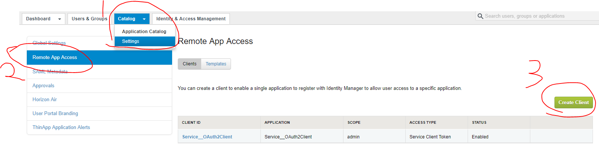
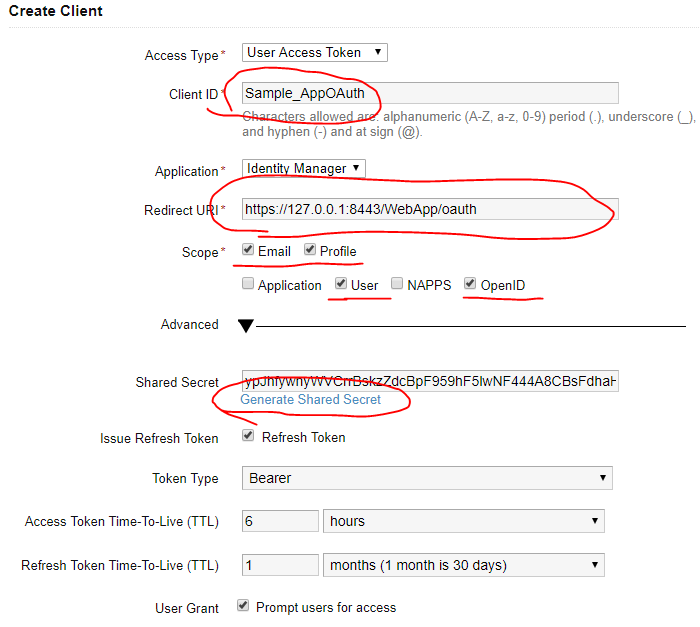
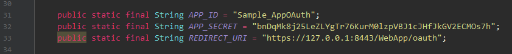

# Sample_AppOAuth

This is also a  sample of using vIDM as IDP and your web application as SP. Any user who wants to
access your web application without authorization will be redirected to vIDM, and if successfully
verified, vIDM will tell you the user's information such as username or email.

## How to use this sample

### Prerequisites

* A valid vIDM administrator account.
* Java 1.6+, Maven.

### Configuration
    
You need to configure your vIDM to use this sample.  

1. Go to your vIDM administrator console, "Catalog" --> "Settings" --> 
"Remote App Access" --> "Create Client"


2. Fill the blanks and save. 


3. Go to [VIDMServlet](src/main/java/com/vmware/eucenablement/sample/VIDMServlet.java#L31),
and configure APP_ID, APP_SECRET and REDIRECT_URI to correct value.


### Build & Run

Be sure you have installed the SamlToolkit by `mvn clean install` on the project base directory.  
Run the following command to start your web application.
```
mvn compile exec:java
```
Then, open [https://127.0.0.1:8443/WebApp](https://127.0.0.1:8443/WebApp), and just
follow the instructions displayed.

## What you need to do

Just refer [configIDPURI.jsp](webapp/configIDPURI.jsp) and
[VIDMServlet](src/main/java/com/vmware/eucenablement/sample/VIDMServlet.java)
to see how it works. 

If you want to deploy it on web server, please re-configure the REDIRECT_URI on your vIDM.

## Documentation

To use vIDM as IDP and authorize by OAuth2, you need to do the following:

Step 1. Create a new VIDMOAuth2Impl by your appid and appsecret. Save it to HttpSession.
```
HttpSession session = req.getSession();
VIDMOAuth2Impl vidmoAuth2 = (VIDMOAuth2Impl)session.getAttribute("oauth");
if (vidmoAuth2 == null) {
    vidmoAuth2 = new VIDMOAuth2Impl(new OAuth2Config(APP_ID, APP_SECRET, REDIRECT_URI));
    session.setAttribute("oauth", vidmoAuth2);
}
return vidmoAuth2;
```

Step 2. Redirect the login request to vIDM.
```
response.sendRedirect(vidmoAuth2.getAuthorizationUrl(""));
```

Step 3. Get access_token and user info by code. All valid attributes can be seen [here](https://github.com/vmware/idm/wiki/Integrating-Webapp-with-OAuth2#using-the-id-token).
```
vidmoAuth2.getAccessTokenFromOAuthServer(code);
// Get username and email
String username = vidmoAuth2.getUsername(), email = vidmoAuth2.getEmail();
// Any other information you want
String given_name = vidmoAuth2.getCurrentAccessToken().getValue("given_name");
```
