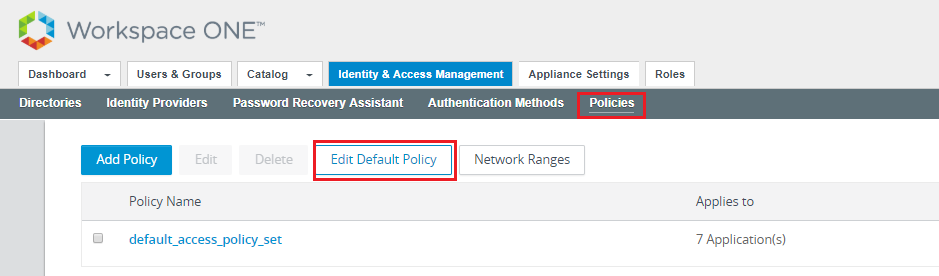
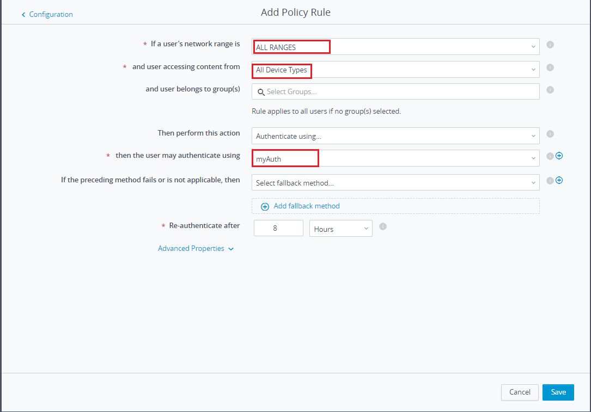

# Sample_AuthServer

This is a sample of using vIDM as SP and your web application as IDP. Any user who wants to
access vIDM without authorization will be redirected to your web application, and you 
may verify the user and notify the vIDM, and the user will login to vIDM successfully
without enter username and password.

## How to use this sample

### Prerequisites

* A valid vIDM administrator account.
* Java 1.6+, Maven.

### Configuration

You need to configure your vIDM to use this sample.  

1. Go to your vIDM administrator console, "Identity Manager" --> "Identity Providers"
--> "Add Identity Provider" --> "Create Third Party IDP".  


2. Fill the blanks with proper values. Just copy the content of [idp.xml](webapp/idp.xml) to the 
SAML Metadata.  


3. Configure the polices by "Policies" --> "Edit Default Policy" --> 
"+". Then edit policy rules with proper values.  


4. Drag the rule to the first place and save.

### Build & Run

You need Java 1.6+, Maven, and a valid vIDM administrator account to run the sample.  

Be sure you have installed the SamlToolkit by `mvn clean install` on the project base directory.  
Run the following command to start your web application.
```
mvn compile exec:java
```
Then, open [https://127.0.0.1:8443/MyAuthServer](https://127.0.0.1:8443/MyAuthServer), and just
follow the instructions displayed.

## What you need to do

Just refer [MyIDPServlet](src/main/java/com/vmware/eucenablement/sample/servlet/MyIDPServlet.java) 
to see how it works. You just need to authorize the user in your own way.

If you want to deploy it on web server, please modify the IP Address in [idp.xml](webapp/idp.xml#L66) 
to the actual IP address, and re-configure the third party IDP on your vIDM.
