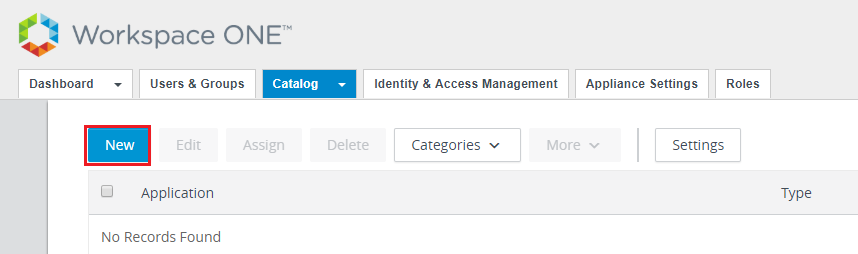
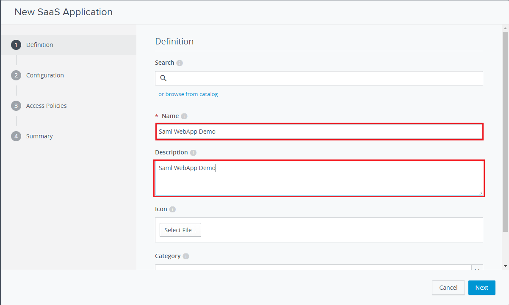

# Sample_WebApp

This is a sample of using vIDM as IDP and your web application as SP. Any user who wants to
access your web application without authorization will be redirected to vIDM, and if successfully
verified, vIDM will tell you the user's information such as uid.

## How to use this sample

### Prerequisites

* A valid vIDM administrator account.
* Java 1.6+, Maven.

### Configuration
    
You need to configure your vIDM to use this sample.  

1. Go to your vIDM administrator console, "Catalog" --> "Application Catalog " --> 
"Add Application" --> "...create a new one"


2. Choose "Manual configuration", and fill the blanks. The domain should be the host or
IP address your web application run on.


3. Add group/user entitlement, and select "Automatic".

### Build & Run

Be sure you have installed the SamlToolkit by `mvn clean install` on the project base directory.  
Run the following command to start your web application.
```
mvn compile exec:java
```
Then, open [https://127.0.0.1:8443/WebApp](https://127.0.0.1:8443/WebApp), and just
follow the instructions displayed.

## What you need to do

Just refer [MyWebServer](src/main/java/com/vmware/eucenablement/sample/MyWebServer.java)
to see how it works. 

If you want to deploy it on web server, please re-configure the consume URL on your vIDM.

## Documentation

To use vIDM as IDP, you need to do the following:

Step 1. Create a new SSOService when your web server is started.
```
SAMLToolkitConf conf = new SAMLToolkitConf();
conf.setIdpURL("${yourcompany}.vmwareidentity.com");
conf.setConsumerURL("http://${host}:${port}/${path_to_consume}");
conf.setByPassSSLCertValidation(true);
SSOService service = new SSOService(conf);
```

Step 2. Redirect the login request to vIDM.
```
String redirectURL = service.getSSOURLRedirect("");
response.sendRedirect(redirectURL);
```

Step 3. Implement your own SAML consumer service like this (can be a Servlet, JSP, or any other else).
```
String samlresponse = ((HttpServletRequest)req).getParameter("SAMLResponse");	
SAMLSsoResponse ssoResponse = service.decodeSSOResponse(samlresponse);
if((ssoResponse != null) && (ssoResponse.isValid()) && (ssoResponse.ssoSucceed())) {
	String username = ssoResponse.getNameId();
	//TODO: SSO is successful, continue your service with this username
}else{
	//TODO: SSO is failed, show an error page or remind the user to login again
}
```
